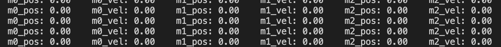

Lab 1 - Hello PID
================================

.. contents:: :depth: 2

Mini-lecture - Actuators and PD Control
-----------------------------
Actuators and PD control lecture by Stuart Bowers, April 10, 2023.

.. raw:: html

    

        <iframe src="https://zoom.us/rec/play/1c0cQPAeGysl2OjbuOgigHnmlHyTEdzntPMIwUq3tFQ0bxE1yJ781MQr1UrmIzBTN0PuVYDhlWObNmUg.e20PoeZU8edSzRHK?canPlayFromShare=true&from=share_recording_detail&continueMode=true&iet=_VWcdTH1meLrBAtT9fwL-yjSG6oPDJuW2UTWOcXA3vo.AG.kyJ9u1DE0K_CVca0wKXrhqiUB3As-hatD26picH4Y6MvaxcNNqM94Gy2knH60lSi2c6B6t3KZOg8irH_oajwz748w0232vC_iLsppO_RRIEKDE6Hm38olZezDpw.ZoMIVLiZzwHPKvBLzudkhQ.WFDGPTA2bzOwLNZb&componentName=rec-play&originRequestUrl=https%3A%2F%2Fzoom.us%2Frec%2Fshare%2FEN_-aXJm1VGmeriFlRF187jg1APqJJRDarMIvqMhzFfAt7JWZfeRXei3wxboVZ2Q.5yPTf8nYK2q5fcph%3Fiet%3D_VWcdTH1meLrBAtT9fwL-yjSG6oPDJuW2UTWOcXA3vo.AG.kyJ9u1DE0K_CVca0wKXrhqiUB3As-hatD26picH4Y6MvaxcNNqM94Gy2knH60lSi2c6B6t3KZOg8irH_oajwz748w0232vC_iLsppO_RRIEKDE6Hm38olZezDpw.ZoMIVLiZzwHPKvBLzudkhQ.WFDGPTA2bzOwLNZb" frameborder="0" allowfullscreen style="position: absolute; top: 0; left: 0; width: 100%; height: 100%;"></iframe>
    

Lab Instructions
----------------------------------
*Goal: Build two robot arms that mirror each other's motion.*

[Insert GIF of completed robot arms]

Step 0. Setup
^^^^^^^^^^^^^^
#. Install `VSCode <https://code.visualstudio.com/Download>`_
#. Install the PlatformIO extension for VSCode. (Might take several minutes on Windows - check the bottom bar in VSCode for status)

.. raw:: html

    

        <iframe src="https://www.youtube.com/embed/LKH2Drp_evc" frameborder="0" allowfullscreen style="position: absolute; top: 0; left: 0; width: 100%; height: 100%;"></iframe>
    

|

Step 1. Assembly motor to base
^^^^^^^^^^^^^^^^^^^^^^^^^^^^^^^

.. raw:: html

    

        <iframe src="https://www.youtube.com/embed/S7Yns-jh8pE" frameborder="0" allowfullscreen style="position: absolute; top: 0; left: 0; width: 100%; height: 100%;"></iframe>
    

|

Step 2. Fasten feet to base
^^^^^^^^^^^^^^^^^^^^^^^^^^^^^^^^^^^^^^^^^^^^^^^^^^^^^^

.. raw:: html

    

        <iframe src="https://www.youtube.com/embed/StzPjM9KXO0" frameborder="0" allowfullscreen style="position: absolute; top: 0; left: 0; width: 100%; height: 100%;"></iframe>
    

|

* Ignore that there's a whole robot arm attached in the video.

Step 3. Attach dial to motor
^^^^^^^^^^^^^^^^^^^^^^^^^^^^^^^^^^^^^^^^^^^^^^^^^^^^^^

.. raw:: html

    

        <iframe src="https://www.youtube.com/embed/jO2BjMUmuZs" frameborder="0" allowfullscreen style="position: absolute; top: 0; left: 0; width: 100%; height: 100%;"></iframe>
    

|

Step 4. Connect and calibrate electronics
^^^^^^^^^^^^^^^^^^^^^^^^^^^^^^^^^^^^^^^^^^^^^^^^^^^^^^

**ELECTRONICS SAFETY:** Make sure to separate the PCB from the metal base before turning on the power, otherwise the circuit will short! Either elevate the PCB above the base with the screws provided, or place the PCB next to the metal base on the table.

.. raw:: html

    

        <iframe src="https://www.youtube.com/embed/r9CnXgrQnfI" frameborder="0" allowfullscreen style="position: absolute; top: 0; left: 0; width: 100%; height: 100%;"></iframe>
    

|

#. Turn on the system: press the power button on the PCB shield.
#. Calibrate: Press and hold the button on the C610 motor controller until the motor starts moving and release.
#. Wait until the C610 motor controller restarts.
#. Set ID: Click the button on the C610 controller, then a little while later (half second or so) press the button again. The light should flash green.
#. The light should now flash once every 2 seconds or so. The number of blinks indicates which ID it is. For example two blinks every 2 seconds indicates ID=2.

**Important:** *To set a motor controller to a certain ID, click (short press) press to put the motor controller into id-setting mode, then click N more times in quick succession, where N is the desired ID. Eg, for a desired ID of 3, press 3 more times after the first click.*

Step 4. Run the starter code
^^^^^^^^^^^^^^^^^^^^^^^^^^^^^^

1. Git clone the `starter code <https://github.com/stanfordroboticsclub/independent-study-lab1>`_, open in VSCode, and upload to Teensy.

.. raw:: html

    

        <iframe src="https://www.youtube.com/embed/WMEhVteT9h4" frameborder="0" allowfullscreen style="position: absolute; top: 0; left: 0; width: 100%; height: 100%;"></iframe>
    

#. Examine where in the code the motor angle and velocity are read in ``src/main.cpp``. Examine where the motor is commanded.
#. Upload starter code to Teensy (right arrow icon in blue bar of VSCode or click the ant icon, then upload)
#. Open the serial monitor in VSCode (icon that looks like a plug in bottom bar of VSCode or click ant icon, then monitor)
#. Click into the serial monitor area and then press the key **s** to make the Teensy start printing out the angle and velocity of the connected motor.
#. Press ``s`` again to stop the program. If you want to rerun the code, upload again or unplug and replug your computer from the Teensy.

    
    Example output from serial monitor.

Step 5. Run bang-bang control
^^^^^^^^^^^^^^^^^^^^^^^^^^^^^^

#. Uncomment the bang-bang code in ``src/main.cpp`` and upload.
#. Observe the effects of changing the current command to something else.
#. *FEEL* how the controller behaves. Move the dial by hand and see how the controller reacts.

.. raw:: html

    

        <iframe src="https://www.youtube.com/embed/cskc04Jdz80" frameborder="0" allowfullscreen style="position: absolute; top: 0; left: 0; width: 100%; height: 100%;"></iframe>
    

*Example bang-bang control.*

|

Step 6. Write PD position control
^^^^^^^^^^^^^^^^^^^^^^^^^^^^^^^^^^

#. Comment out the bang-bang controller.
#. Complete the pd_control function in ``src/main.cpp``. Your function should return a current command (100mA, 200mA etc) using the PD control law ``tau = Kp * (target - theta) + Kd * (-omega)``.
#. Use Kp = 1000.0 and Kd = 0.0 to start. Don't forget the negative signs! 
#. Upload code to Teensy
#. *FEEL* the effect of the PD controller.
#. What happens when you rotate the disc just a little bit away from the target position? What happens when you rotate it a lot away from the target position? Do you feel the motor torque increase and then flatten out as you rotate the disc?

[Insert gif of proper PD joint control]

Step 7. Experiment with different parameters
^^^^^^^^^^^^^^^^^^^^^^^^^^^^^^^^^^^^^^^^^^^^^
Note: Some of these steps will cause the output disc to go unstable and violently shake, be prepared!

For each of these situations (except the ones that go unstable), rotate the disc around with your hand to get a physical sense for the PD behavior.

#. Keeping Kd constant (0), experiment with Kp = -100 and Kp = 5000. Discuss with your partner how each feels. How are Kp and stiffness related?
#. Keeping Kp constant (1000), experiment with different Kd values from -10 to 1000
#. See what happens when Kp is too high. Try Kp=50000 and Kd=100.
#. See what happens when Kd is too high. Try Kp=0 and Kd=100000.
#. See what happens with just moderate damping. Try Kp=0 and Kd=100. 

The expected behavior is that higher Kp values will make the position control more stiff while higher Kd values will make the motor slower to achieve the desired position.
If either gain is too high or is negative, the motor will go unstable.

[Insert gif of some instability]

Step 8. Experiment with different loop rates
^^^^^^^^^^^^^^^^^^^^^^^^^^^^^^^^^^^^^^^^^^^^^

#. Examine where the code is checking if it's time to issue another control update.
#. Change the update rate to 4Hz with Kp=1000 and Kd=100 to observe instability.

Step 9. Program periodic motion
^^^^^^^^^^^^^^^^^^^^^^^^^^^^^^^^^^^

1. Set the update rate back to 200Hz (5ms interval).
2. Program the motor to track a sinusoidal position, like the psuedocode below. 

.. code-block:: c++

    float time = millis() / 1000.0
    position_target = sin(time)

3. Play around with different frequencies. How high can you raise the frequency before the motor no longer moves as much as you expect? 

Fun fact, the maximum frequency you can go before the motor moves to only 71% (-3dB) of the intended motion is called the bandwidth.

[Insert gif of sinusoidal motion]

(Old) Mini-lecture - Joint Control
-----------------------------

.. raw:: html

    

        <iframe src="https://www.youtube.com/embed/GZb0ZHpmb28" frameborder="0" allowfullscreen style="position: absolute; top: 0; left: 0; width: 100%; height: 100%;"></iframe>
    

