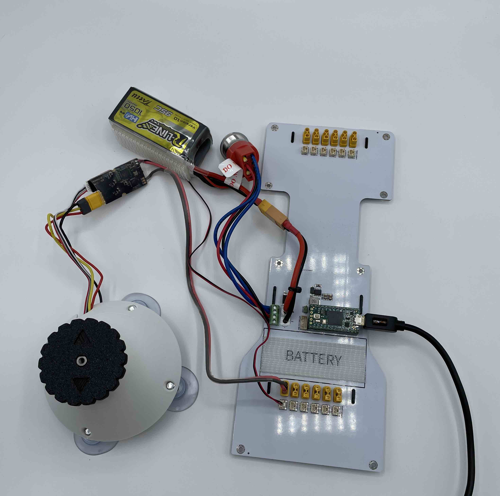
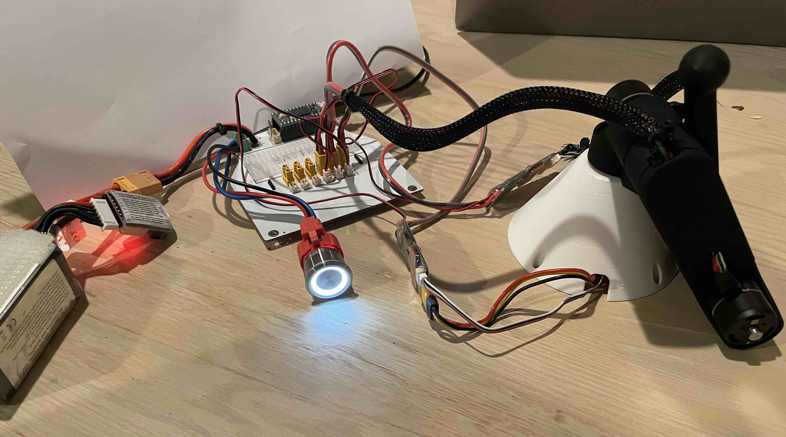

Lab 1 - The Worst Robot Surgeon
================================

.. contents:: :depth: 2

Mini-lecture - Joint Control
-----------------------------

* Video: Available soon

Lab Instructions
----------------------------------
*Goal: Build two robot arms that mirror each other's motion.*

[Insert GIF of completed robot arms]

Step 0. Setup
^^^^^^^^^^^^^^
#. Install `VSCode <https://code.visualstudio.com/Download>`_
#. Install the PlatformIO extension for VSCode.

.. raw:: html

    

        <iframe src="https://www.youtube.com/embed/LKH2Drp_evc" frameborder="0" allowfullscreen style="position: absolute; top: 0; left: 0; width: 100%; height: 100%;"></iframe>
    

Step 1. Connecting hardware
^^^^^^^^^^^^^^^^^^^^^^^^^^^^

#. Attach the M2006 motor to the white cone via 3 M3x8mm flat head screws (M3 is the diameter, 8mm is the length, flat head means the top of the screw is flat and has a cone shape underneath.)
#. Plug the M2006's 3-wire power cable and 4-wire ribbon encoder cable into the C610 motor controller.
#. Plug the motor controller's 2-wire power cable into a XT30 port on the PCB in the row near the Teensy.
#. Plug in the 2-wire CAN cable into a CAN port in the row near the Teensy.
#. Plug the Teensy into the socket on the Pupper PCB if it's not already.
#. Plug the power supply or battery into the Pupper PCB's XT60 connector.
#. Plug the Teensy into your laptop via micro USB to USB A to C.

    
    M2006 motor connected to C610 motor controller connected to Pupper PCB. Battery and power switch connected. Teensy plugged in.

Step 2. Set up the motor
^^^^^^^^^^^^^^^^^^^^^^^^^^^

#. Turn on the system: press the power button on the PCB shield.
#. Calibrate: Press and hold the button on the C610 motor controller until the motor starts moving and release.
#. Wait until the C610 motor controller restarts.
#. Set ID: Press the button on the C610 controller, then a little while later (half second) press the button again. The light should flash green.
#. The light should now flash once every 5 seconds or so. The number of blinks indicates which ID it is. For example two blinks every 5 seconds indicates ID=2.

.. raw:: html

    

        <iframe src="https://www.youtube.com/embed/MgJmoMeYv3w" frameborder="0" allowfullscreen style="position: absolute; top: 0; left: 0; width: 100%; height: 100%;"></iframe>
    

*Example of calibrating the motor and setting ID=3. For your actuator, you should set ID=1 instead.*

|

Step 3. Run the starter code
^^^^^^^^^^^^^^^^^^^^^^^^^^^^^^

#. Get the starter code: https://github.com/stanfordroboticsclub/independent-study-lab1 (instructions to download on this page)
#. Open starter code using PlatformIO home page in VSCode (click the ant icon in the left bar, then PIO Home -> Open, then open the independent-study-lab1 folder).
#. Examine where in the code the motor angle and velocity are read. Examine where the motor is commanded.
#. Upload starter code to Teensy (right arrow icon in blue bar of VSCode or click the ant icon, then upload)
#. Open the serial monitor in VSCode (icon that looks like a plug in bottom bar of VSCode or click ant icon, then monitor)
#. Click into the serial monitor area and then press the key **s** to make the Teensy start printing out the angle and velocity of the connected motor.
#. Press **s** again to stop the program. If you want to rerun the code, upload again or unplug and replug your computer from the Teensy.

.. figure:: ../_static/example-output.png
    :align: center
    
    Example output from serial monitor.

Step 4. Run bang-bang control
^^^^^^^^^^^^^^^^^^^^^^^^^^^^^^

#. Uncomment the bang-bang code and upload.
#. Observe the effects of changing the current command to something else.

.. raw:: html

    

        <iframe src="https://www.youtube.com/embed/cskc04Jdz80" frameborder="0" allowfullscreen style="position: absolute; top: 0; left: 0; width: 100%; height: 100%;"></iframe>
    

*Example bang-bang control.*

|

Step 5. Write PD position control
^^^^^^^^^^^^^^^^^^^^^^^^^^^^^^^^^^

#. Comment out the bang-bang controller and comment in the call to the PD control. The function should return the current (100mA, 200mA etc) command.
#. Use Kp = 1000.0 and Kd = 0.0 to start. Don't forget the negative signs! 
#. Upload code to Teensy

[Insert gif of proper PD joint control]

Step 6. Experiment with different parameters
^^^^^^^^^^^^^^^^^^^^^^^^^^^^^^^^^^^^^^^^^^^^^
Note: Some of these steps will cause the output disc to go unstable and violently shake, be prepared!

#. Keeping Kd constant (0), experiment with Kp = -10 and Kp = 5000
#. Keeping Kp constant (1000), experiment with different Kd values from -10 to 1000
#. See what happens when Kp is too high. Try Kp=50000 and Kd=100.
#. See what happens when Kd is too high. Try Kp=0 and Kd=100000.
#. See what happens with just moderate damping. Try Kp=0 and Kd=100.

The expected behavior is that higher Kp values will make the position control more stiff while higher Kd values will make the motor slower to achieve the desired position.
If either gain is too high or is negative, the motor will go unstable.

[Insert gif of some instability]

Step 7. Experiment with different loop rates
^^^^^^^^^^^^^^^^^^^^^^^^^^^^^^^^^^^^^^^^^^^^^

#. Examine where the code is checking if it's time to issue another control update.
#. Change the update rate to 4Hz with Kp=1000 and Kd=100 to observe instability.

Step 8. Program periodic motion
^^^^^^^^^^^^^^^^^^^^^^^^^^^^^^^^^^^

1. Program the motor to track a sinusoidal position, like the psuedocode below. 

.. code-block:: c++

    float time = millis() / 1000.0
    position_target = sin(time)

2. Play around with different frequencies. How high can you raise the frequency before the motor no longer moves as much as you expect? 

Fun fact, the maximum frequency you can go before the motor moves to only 71% (-3dB) of the intended motion is called the bandwidth.

[Insert gif of sinusoidal motion]

Step 9. Connect and control 2 more motors
^^^^^^^^^^^^^^^^^^^^^^^^^^^^^^^^^^^^^^^^^^^^

#. Connect power and encoder cables from motors to controllers.
#. Connect power and CAN cables from controllers Pupper PCB
#. Run your PD control on the two additional motors with some target position.

[insert pic of compeleted setup]

Step 10. Assemble the three motors into a robot arm!
^^^^^^^^^^^^^^^^^^^^^^^^^^^^^^^^^^^^^^^^^^^^^^^^^^^^^^

[Gabrael adds assembly video]

    
    Robot arm built (yours may not have the black wire wrap).

Step 11. Run your code again on the new robot arm
^^^^^^^^^^^^^^^^^^^^^^^^^^^^^^^^^^^^^^^^^^^^^^^^^^^^^^

#. Upload and run code for controlling the 3 motors simultaneously.

.. raw:: html

    

        <iframe src="https://www.youtube.com/embed/SVwILVoCzxM" frameborder="0" allowfullscreen style="position: absolute; top: 0; left: 0; width: 100%; height: 100%;"></iframe>
    

*Example where the arm PID positions targets are set so that it stands up vertically.*

|

Step 12. Connect three more motors to use as control dials
^^^^^^^^^^^^^^^^^^^^^^^^^^^^^^^^^^^^^^^^^^^^^^^^^^^^^^^^^^^^^^^^^^^^^^^^^^^^^^^^^^^^^^^^^^^^^^^^^^^^^^^^^^^^
#. Calibrate and connet three additional motors to the Pupper PCB
#. Set the target positions of the shoulder abductor motor, shoulder rotator motor, and elbow motor to the angle readings of the first, second, and third new motors respectively.

[gif]

Step 13. Assemble the three new motors into a robot arm
^^^^^^^^^^^^^^^^^^^^^^^^^^^^^^^^^^^^^^^^^^^^^^^^^^^^^^^^
[pic]

Step 14. Use the arms as leader and follower.
^^^^^^^^^^^^^^^^^^^^^^^^^^^^^^^^^^^^^^^^^^^^^
#. Use the same code as in step 12.
#. Start the robot arms from the same position.
#. Tune Kp and Kd gains and maximum current as you like.

[pic]

Step 15. Make the robot arms bidirectional!
^^^^^^^^^^^^^^^^^^^^^^^^^^^^^^^^^^^^^^^^^^^^^
#. Program position control for the leader arm actuators (formerly control dial actuators)
#. Set the position targets of the leader arm to the positions of the follower arm.
#. Congrats. Play with your robot! Make modifications!

[gif]