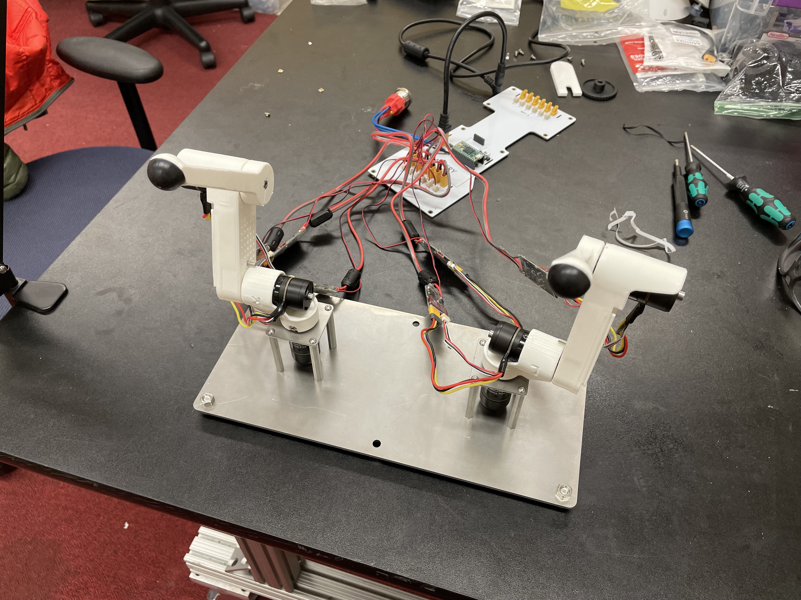

Lab 3 - Forward Kinematics
=======================================================

.. contents:: :depth: 2

Lecture 
----------
Forward kinematics lecture

.. raw:: html

    

        <iframe src="https://www.youtube.com/embed/nFqTsAEywpY" frameborder="0" allowfullscreen style="position: absolute; top: 0; left: 0; width: 100%; height: 100%;"></iframe>
    

|

Follow-up lecture to clarify some things

.. raw:: html

    

        <iframe src="https://www.youtube.com/embed/XAUXrRtINTQ" frameborder="0" allowfullscreen style="position: absolute; top: 0; left: 0; width: 100%; height: 100%;"></iframe>
    

|

Lab Instructions
----------------------------------
*Goal: 1) Learn how to compute forward kinematics 2) Become familiar with simulation-to-real pipeline.*

    
    TODO: picture of sim and real robot together

Step 0. Flash Teensy with our firmware
^^^^^^^^^^^^^^^^^^^^^^^^^^^^^^^^^^^^^^^^^^^^
#. Download https://github.com/stanfordroboticsclub/reacher-lab/blob/main/firmware.hex
#. Follow the instructions in this video to flash the Teensy. In the video when they say to use a paperclip to press the button, you can just press the button on the Teensy directly instead. https://www.youtube.com/watch?v=9PyiGUO9_KQ. If you can't find the Teensyloader application on your computer, you can upload any random Teensy code through VSCode and that will open the Teensyloader window which you can then use to flash the Teensy. 

Step 1. Install simulator
^^^^^^^^^^^^^^^^^^^^^^^^^^^^^^^^^^^^^^^^^^^^
Follow the instructions available at https://github.com/stanfordroboticsclub/reacher-lab to install and run the reacher code in simulation

Step 2. Test simulator
^^^^^^^^^^^^^^^^^^^^^^^^^^^^^^^^^^^^^^^^^^^^
Run ``python reacher/reacher_manual_control.py``

Step 3. Test robot simultaneously with simulator
^^^^^^^^^^^^^^^^^^^^^^^^^^^^^^^^^^^^^^^^^^^^^^^^^^^^^^^^^^^^^^^^^^^^^^^^^^^^^^^^^^^^^^^^
Run ``python reacher/reacher_manual_control.py --run_on_robot``

The robot should match the motion of the robot in the simulator. Note: if you click and drag the robot in the simulator, the real robot will NOT follow. The real robot is following the joint angles set by the sliders.

Step 4. Code forward kinematics
^^^^^^^^^^^^^^^^^^^^^^^^^^^^^^^^^^^^^^^^^^^^

#. Complete the function ``calculate_forward_kinematics_robot`` in ``reacher/reacher_kinematics.py``.
#. Run ``python reacher/reacher_manual_control.py`` to verify with the white ball. Ensure you are in the correct directory

The output of your kinematics functions sets the white ball's position in the simulator, so ideally, the red ball fixed to the end of the robot arm should track the white ball nearly perfectly.

The result should look something like this

.. raw:: html

    

        <iframe src="https://www.youtube.com/embed/to-O401I6PE" frameborder="0" allowfullscreen style="position: absolute; top: 0; left: 0; width: 100%; height: 100%;"></iframe>
    

**Debugging tips**
#. Use numpy operators for your matrix operations
#. Check the shape of your vectors and matrices matches what you expect. This is where most students run into trouble. Remember the rules of matrix multiplication.

|
