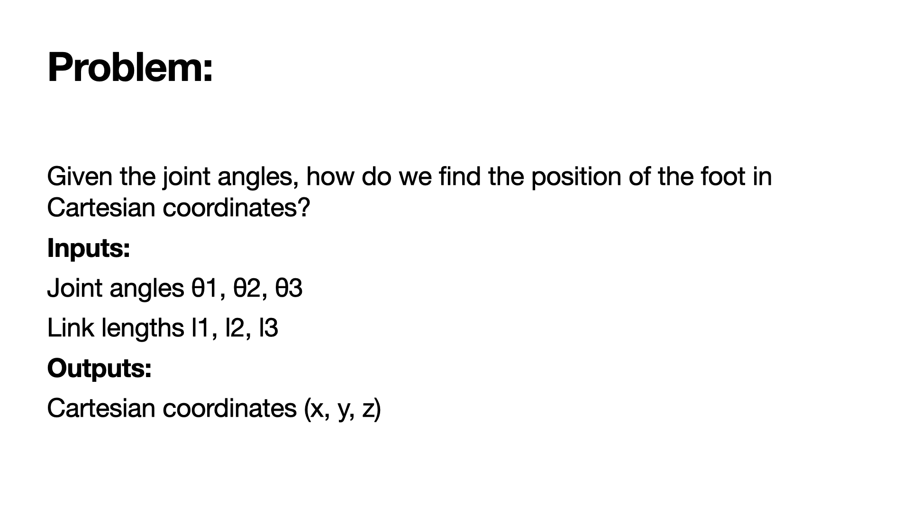
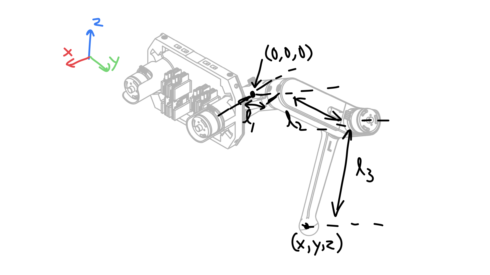
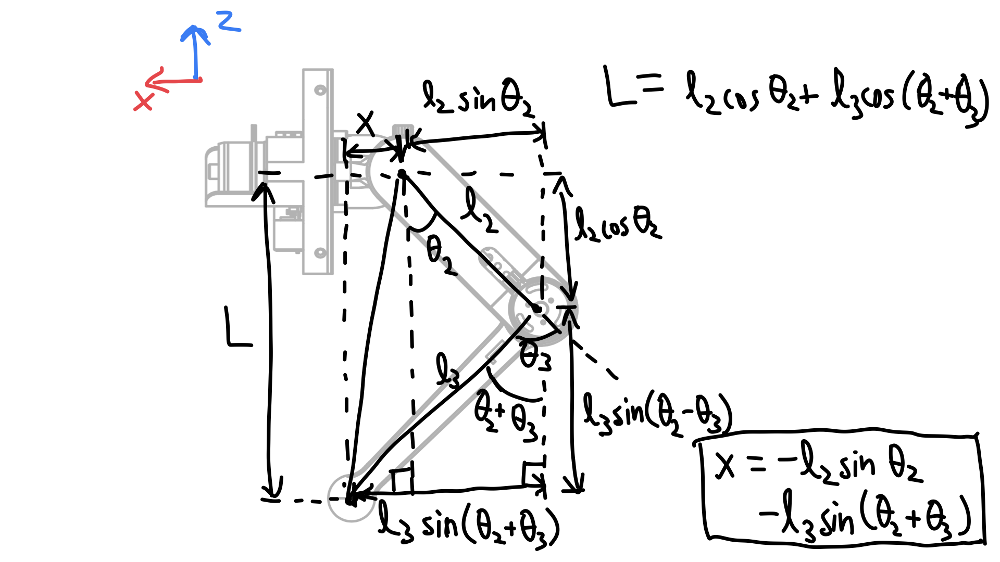
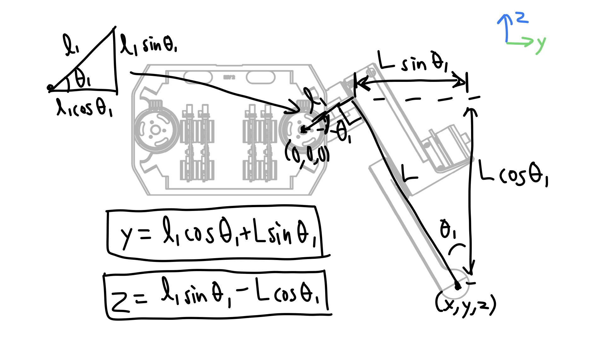
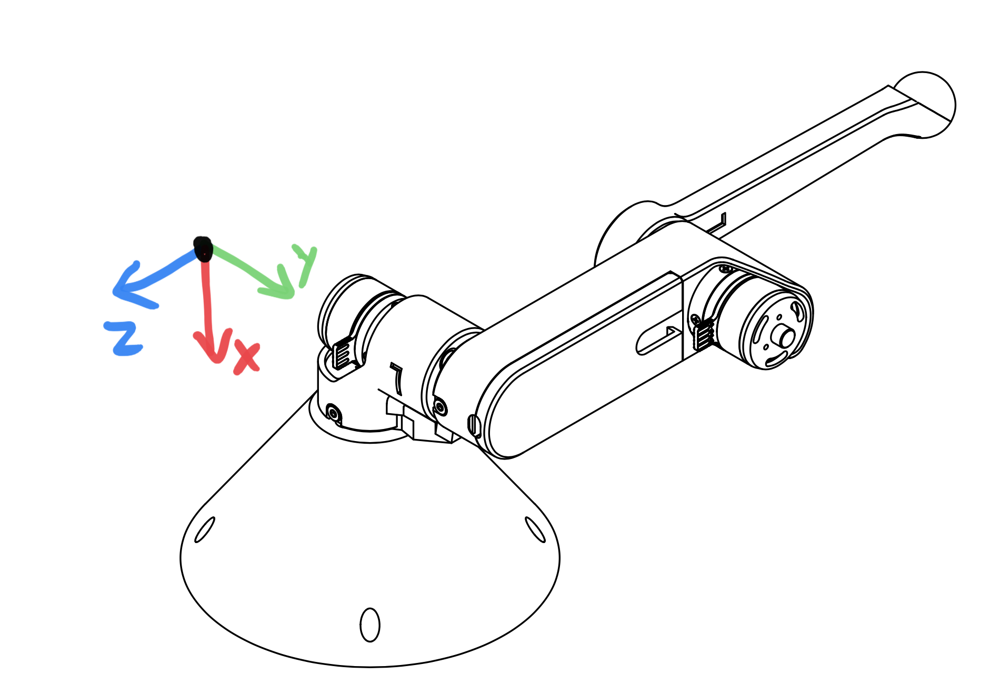

Lab 3 - Safety Dance (Fall 2021)
================================

.. contents:: :depth: 2

Mini-lecture - Forward Kinematics
------------------------------------

.. raw:: html

    <iframe src="https://stanford195.autodesk360.com/shares/public/SH35dfcQT936092f0e43e4b3d19bbaacc90a?mode=embed" width="640" height="480" allowfullscreen="true" webkitallowfullscreen="true" mozallowfullscreen="true"  frameborder="0"></iframe>
    

*3D illustration of motor angles, directions of positive rotation, and relevant geometry.*

    
    Problem statement.

    
    Coordinate frame, link lengths, and leg origin illustration.

    
    Derivation of x coordinate of foot and L.

    
    Derivation of y and z coordinate of foot.

Lab Instructions
------------------

Step 0. Get the starter code
^^^^^^^^^^^^^^^^^^^^^^^^^^^^^^^^^^^^^^^^^^^^^^^^^^^^^^^^^
#. Get the starter code https://github.com/stanfordroboticsclub/independent-study-lab2
#. Make sure to follow the installation instructions for the repo.

Step 1. Prepare hardware
^^^^^^^^^^^^^^^^^^^^^^^^^^^
#. Set the controller for the base actuactor of the robot arm to 1 (1 blink). 
#. Set the controller for the shoulder actuactor of the robot arm to 2 (2 blinks). 
#. Set the controller for the elbow actuactor of the robot arm to 3 (3 blinks).
#. Make sure all the motor controllers are plugged into the CAN 2 bus (the set of connectors near the Teensy).

Step 1. Implement and test a forward kinematics function
^^^^^^^^^^^^^^^^^^^^^^^^^^^^^^^^^^^^^^^^^^^^^^^^^^^^^^^^^
#. Determine if you have a right or left robot leg (there's a L or R on the lower link). 
#. Update line 15 of *src/main.cpp* based on the what side leg you have.
#. Complete the forward_kinematics function inside of src/kinematics.h. You should return a BLA::Matrix<3> of the cartesian coordinates of the end-effector.
#. Upload code.
#. Press s to start. The starter code will first test your kinematics code and then run the main loop.

Step 2. View cartesian coordinates of end effector
^^^^^^^^^^^^^^^^^^^^^^^^^^^^^^^^^^^^^^^^^^^^^^^^^^^
#. Start the robot from the zero position. See picture below
#. Print out the cartesian coordinates of the end effector using your forward kinematics function

    
    A left robot arm in the starting position for lab 2 and its coordinate system.

Step 3. Make a safety box
^^^^^^^^^^^^^^^^^^^^^^^^^^^^^^^^^^^^^^^^^^^^^^^^^^^
#. Pick a "safety" box -- a virtual box in cartesian coordinates that the robot can operate safely in. For example, -0.1<x<0.1 and -.1<y>0.1 and 0<z<-0.2.
#. Print a warning whenever the robot leaves the safety box.

Step 4. Do the `safety dance <https://www.youtube.com/watch?v=nM4okRvCg2g&ab_channel=MenWithoutHatsVEVO>`_
^^^^^^^^^^^^^^^^^^^^^^^^^^^^^^^^^^^^^^^^^^^^^^^^^^^^^^^^^^^^^^^
#. Make a function to vibrate the motors (high frequency, low amplitude torque command sinusoid) 
#. If you program a torque sinusoid, a safe range for the amplitude is around 500 - 4000mA. Any lower is barely perceptible.
#. Run the function whenever the robot end effector leaves the safety box.

[gif of completed project]
