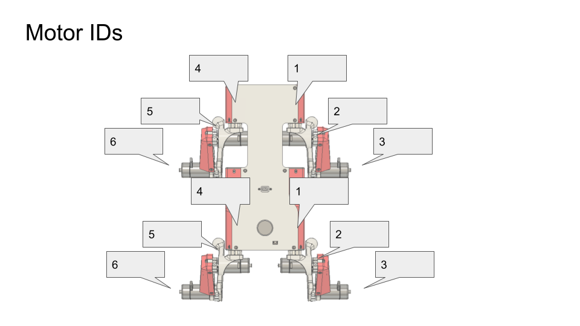

Lab 6 - Pupper Assembly
========================

.. contents:: :depth: 2

Lab instructions
-------------------

Step 1. Leg Assembly
^^^^^^^^^^^^^^^^^^^^^^^^^^^^^^^^^^^^^^^^
* Make 1 more left leg and 1 more right leg using instructions in lab 2, however, do not attach the "base" motor

Step 2. Bulkhead assembly
^^^^^^^^^^^^^^^^^^^^^^^^^^^^^^^^^^^^^^^^

.. raw:: html

    

        <iframe src="https://www.youtube.com/embed/Xhj-rCPxm6o" frameborder="0" allowfullscreen style="position: absolute; top: 0; left: 0; width: 100%; height: 100%;"></iframe>
    

|

#. Detach your robot arms from the base 
#. Attach 2 motors, one into each side of motor bulkhead, with 3 M3x6 phillips head screws each
#. Attach left and right legs to the shafts of the motors you just installed and screw in shoulder bolt tightly
#. Thread the wrapped cables through slots
#. Zip tie the cables to keep them in place
#. Clip motor controllers into place
#. Connect motor and encoder cables to motor controllers
#. Repeat this process so you have two motor bulkheads with four legs total

CHECK. Ensure Motor IDs are correct
^^^^^^^^^^^^^^^^^^^^^^^^^^^^^^^^^^^^^^^^

Use this diagram to ensure you have the correct IDs set on your motor controllers. For each bulkhead you should have:

Right left/right motion hip motor: 1

Right forward/back motion hip motor: 2

Right knee motor: 3

Left left/right motion hip motor: 4

Left forward/back motion hip motor: 5

Left knee motor: 6

    
    Motor ID diagram

Step 3. Body assembly
^^^^^^^^^^^^^^^^^^^^^^^^^^^^^^^^^^^^^^^^

.. raw:: html

    

        <iframe src="https://www.youtube.com/embed/vv3jABUq3ng" frameborder="0" allowfullscreen style="position: absolute; top: 0; left: 0; width: 100%; height: 100%;"></iframe>
    

|

#. Place front motor bulkhead
#. Connect motor controller power cables (yellow XT30) and CAN connectors (small white JST GH) to bottom PCB
#. Place back motor bulkhead and connect cables
#. Flip robot and fasten bulkheads to bottom PCB with 4x M3x6 button head screws
#. Tighten these screws well and/or add loctite 

Step 4. Electronics bulkhead assembly
^^^^^^^^^^^^^^^^^^^^^^^^^^^^^^^^^^^^^^^^^^^^^^^^^^^^^^^^^^^^

.. raw:: html

    

        <iframe src="https://www.youtube.com/embed/OArwzrKzQdM" frameborder="0" allowfullscreen style="position: absolute; top: 0; left: 0; width: 100%; height: 100%;"></iframe>
    

|

#. Screw RPi into electronics bulkhead with M2.5x5 socket head screws such that the Pi is oriented like in the video.
#. Connect USB C extension cable to Rpi
#. Connect RPi camera flex cable into RPi. There's a little grey flap that flips up on the connector that lets you slide the cable in. Flip the flap down to lock the cable in.
#. Connect RPi to power by using 2-pin cable. Connect one end into 5V, GND pins near the Teensy and other side into RPi. Quadruple-check that the 5V and GND pins are going the right places. See diagram.
#. Connect RPi to Teensy using USB A to USB micro cable
#. Connect RC receiver to RPi with usb extension cable.

Step 5. Top panel assembly
^^^^^^^^^^^^^^^^^^^^^^^^^^^^^^^^^^^^^^^^^^^^^^^^^^^^^^^^^^^^

.. raw:: html

    

        <iframe src="https://www.youtube.com/embed/15xuPJpki4M" frameborder="0" allowfullscreen style="position: absolute; top: 0; left: 0; width: 100%; height: 100%;"></iframe>
    

|

#. Insert the XT60 female side (conductor is a circular slot) of XT60 splitter cable into 3D printed power hub. 
#. Insert JST-XH extender balance cable into 3D printed power hub.
#. Attach the 3D printed power hub to the top PCB with 2 M3x6 button head screws.
#. Take the large nut off the power switch and then mount the power switch to the top PCB panel. Then secure the switch by threading on the nut from the bottom of the top panel.
#. Screw the USB-C connector to the top PCB with 2 M3x6 button head screws
#. Connect other female XT60 into the bottom PCB

.. figure:: ../_static/rpi-pinout.png
    :align: center
    
    RPi pinout. 

.. figure:: ../_static/djipupper_photos/IMG_0880.jpg
    :align: center
    
    Bulkhead wiring.

.. figure:: ../_static/djipupper_photos/IMG_0881.jpg
    :align: center
    
    Zip-tie close up.

.. figure:: ../_static/djipupper_photos/IMG_0882.jpg
    :align: center
    
    Leg assembly.

.. figure:: ../_static/djipupper_photos/IMG_0883.jpg
    :align: center
    
    Electronics assembly.

.. figure:: ../_static/djipupper_photos/IMG_0884.jpg
    :align: center
    
    Bottom view of top PCB.

.. figure:: ../_static/djipupper_photos/IMG_0885.jpg
    :align: center
    
    Top view of top PCB.

Step 6. Attach front panel
^^^^^^^^^^^^^^^^^^^^^^^^^^^^^^^^^^^^^^^^^^^^^^^^^^^^^^^^^^^^
#. Attach the Pi Camera to the front Pupper panel with M2x4 socket head cap screws
#. Attach the front Pupper panel with 2 M3x6 button head screws to the bottom PCB

Step 7. Bind RC receiver
^^^^^^^^^^^^^^^^^^^^^^^^^^^^^^^^^^^^^^^^^^^^^^^^^^^^^^^^^^^^
#. Get a FRSKY USB receiver and a BetaFPV Transmitter
#. While holding the button on the USB receiver down, insert it into your computer. It should show a flashing red light.
#. Then turn on the transmitter: Press and hold the power button for about 5 seconds until twice vibration. The LED will be green first. Wiggle the left stick until the LED turns blue. Then the LiteRadio is powered on.
#. Press the BIND button from the back of the transmitter. The transmitter will enter the binding mode and last about 10 seconds, indicated by blue and red LED flash alternately.
#. Once bound, the receiver should then show a solid (not blinking) green color.
#. Unplug and re-plug the receiver into your computer and restart the transmitter. Then go to https://gamepad-tester.com/ in CHROME (no other browsers will work) to test that the receiver is receiving messages from the transmitter.
#. Refer to the transmitter manual for more info if needed https://support.betafpv.com/hc/en-us/articles/900003583046-Manual-for-LiteRadio-2.
#. Refer to the receiver manual for more info if needed https://www.frsky-rc.com/wp-content/uploads/Downloads/Manual/XSR-SIM/XSR-SIM-%20manual.pdf 

Step 8. Finish hardware assembly
^^^^^^^^^^^^^^^^^^^^^^^^^^^^^^^^^
#. Put velcro or dual-lock onto the bottom PCB where it says "battery". For now we'll use the power supply to run the robot so you don't have to install the actual battery.
#. Attach the top PCB panel with M3x6 button head screws. 
#. Check again with instructors.
#. Marvel at your work!

Step 9. Flash code onto the Teensy
^^^^^^^^^^^^^^^^^^^^^^^^^^^^^^^^^^^
#. Go to https://github.com/Nate711/DJIPupperTests/blob/master/README.md for instructions on how to download and set up the Teensy firmware
#. Use VSCode PlatformIO to open the DJIPupperTests folder as a project and then upload the code to the Teensy. (Same thing as in labs 1-4).

Step 10. Flash software image onto Raspberry Pi
^^^^^^^^^^^^^^^^^^^^^^^^^^^^^^^^^^^^^^^^^^^^^^^^^^^^^^^^^^^^^^^^^^^^^^
#. Download our `image <https://drive.google.com/file/d/1LWupKrq-aiqHTXsXZ3rIQzXBHl4DCbSj/view?usp=sharing>`_
#. Install `Balena etcher <https://www.balena.io/etcher/>`_
#. Flash the image onto the micro SD card using Balena etcher. 
#. Insert the micro sd card into the Pi's micro sd card slot (on bottom side of board)

Step 11. Enable the heuristic controller
^^^^^^^^^^^^^^^^^^^^^^^^^^^^^^^^^^^^^^^^^^
#. Connect the robot to your computer via the top USB-C port on the robot.
#. SSH into the robot with ``ssh pi@raspberrypi.local``. The password is ``raspberry``. Ask for help if this doesn't work.
#. Run ``sudo systemctl enable --now robot`` to turn on the heuristic controller.
#. Run ``sudo systemctl status robot`` to check that the service is running ok (should be green).
#. Reboot with ``sudo reboot 0``

Step 12. Take your robot on a walk
^^^^^^^^^^^^^^^^^^^^^^^^^^^^^^^^^^^^
#. Unplug the Pi from USB C.
#. Place your robot on a flat, level surface. Position the legs as shown in the picture below.
#. Power on the robot by hooking up the power supply to the bottom PCB (like you've done in labs).
#. Connect the Pi with USB C to your computer.
#. Wait for the robot to complete the calibration sequence. During the calibration sequence, the hips should turn inwards until they hit the stops, then back down. Then the thigh pieces should rotate upward until they hit their stops and then back down. **TODO** Add calibration video
#. Flip all switches on the back RC transmitter down so they're away from you.
#. Turn on the RC transmitter by pressing the middle power button and moving the left joystick up and down until the light turns blue.
#. Wait ~30s for the RPi to boot (the green light should stop blinking).
#. Flip the lower left switch on the controller up to enable the robot. It'll move!
#. Flip the lower right switch on the controller up to start the robot trotting.
#. Enjoy your hard work and play with Pupper! 

  * The top right switch flips between trotting and walking. 
  * Left/right on the left joystick controls turning. 
  * Up/down on the right joystick controls forward/back. 
  * Left/right on the right joystick controls strafing left/right.

.. figure:: ../_static/djipupper_photos/startup-position.png
    :align: center
    
    Startup position.

Resources
-----------

Wiring diagram
^^^^^^^^^^^^^^^^^^^^^^^^^^^^^^
.. figure:: ../_static/wiring-diagram.png
    :align: center
    
    Wiring diagram.
