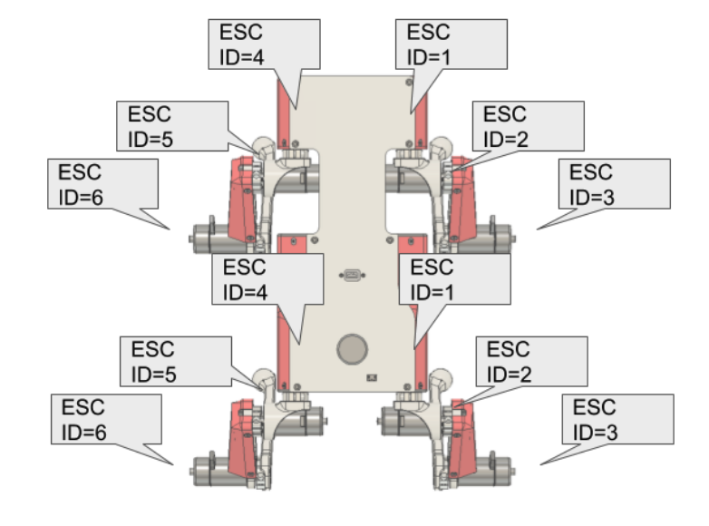
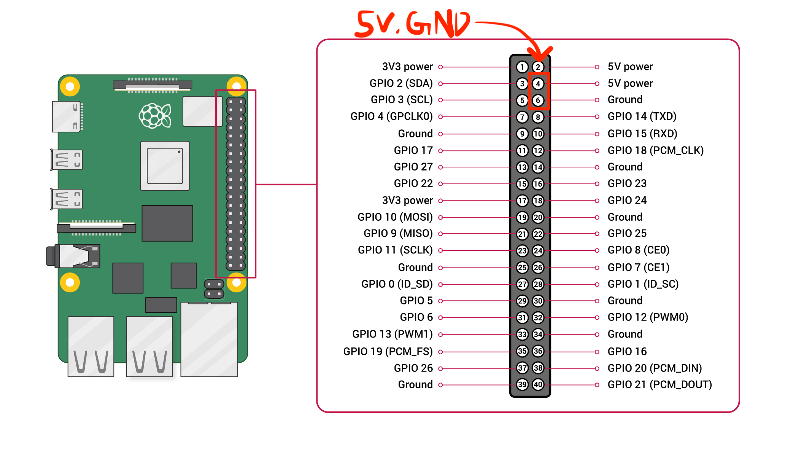
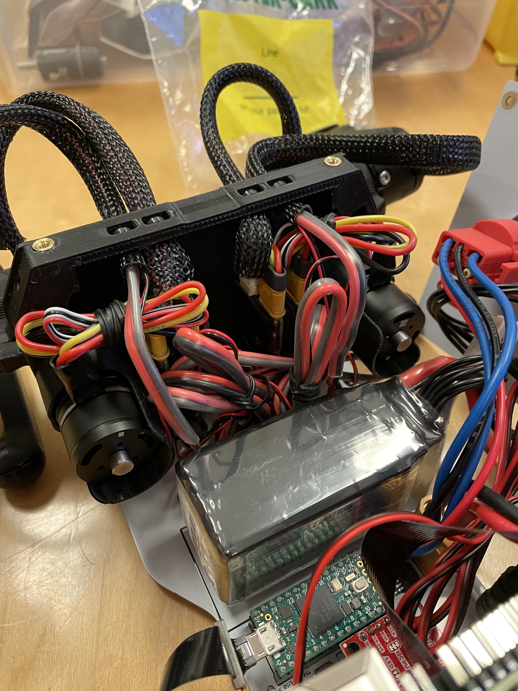
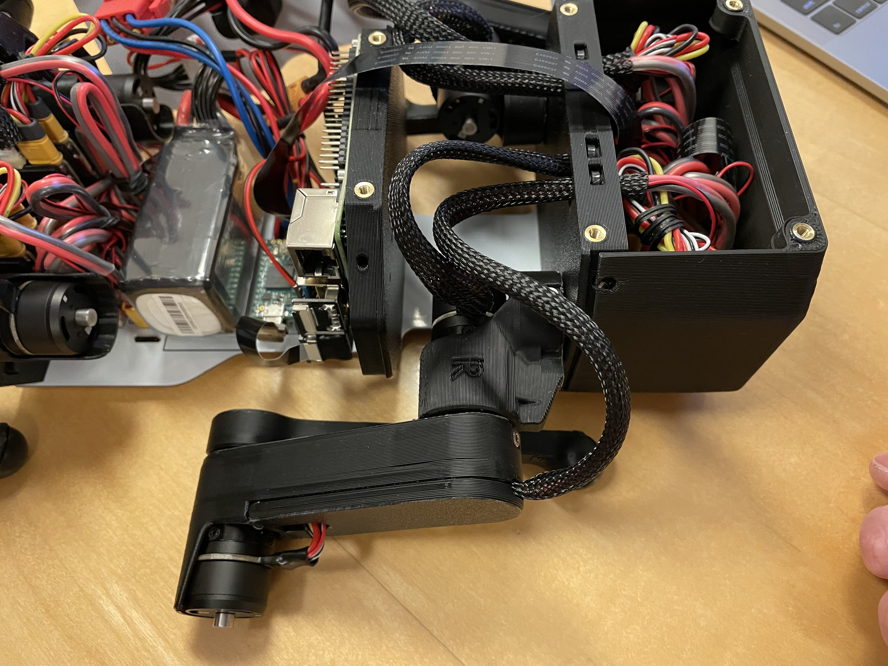
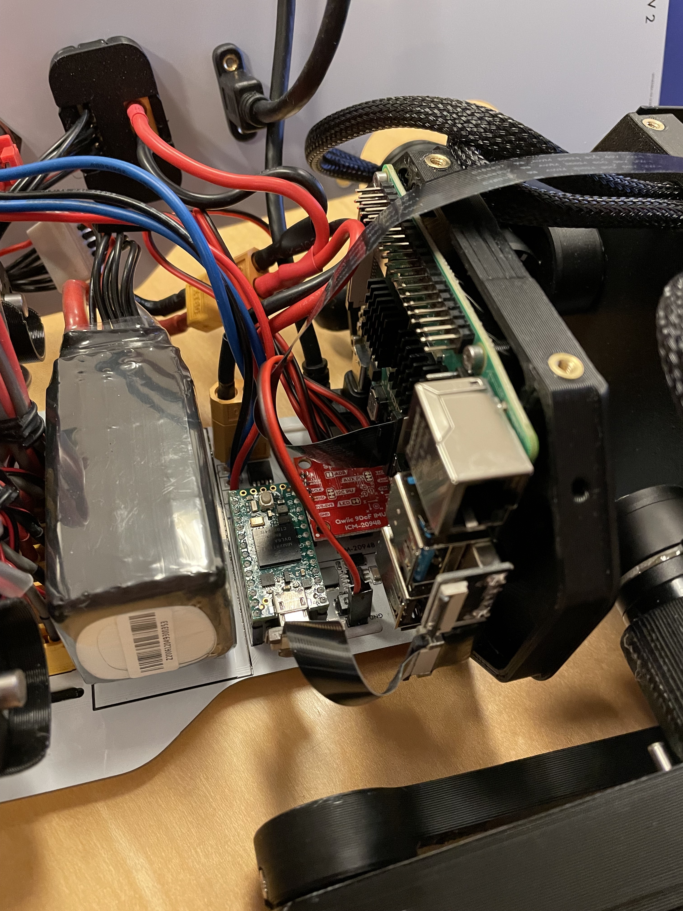
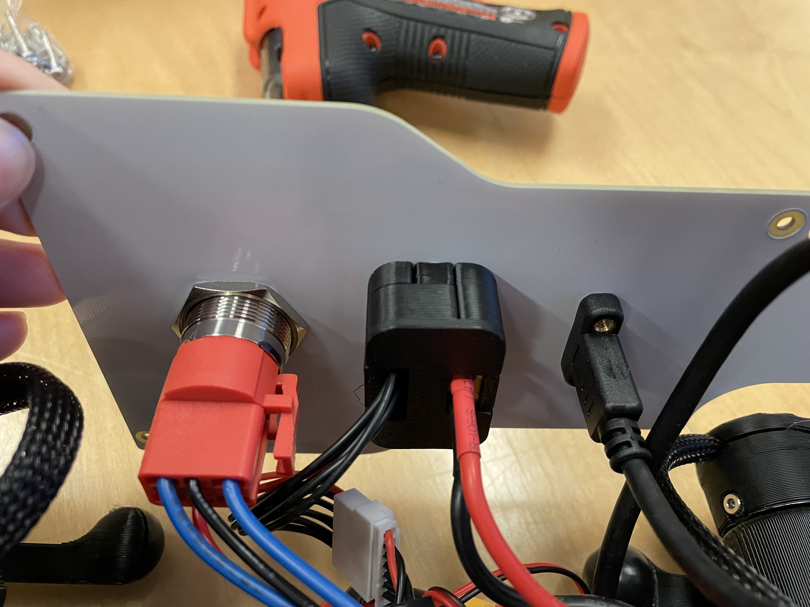
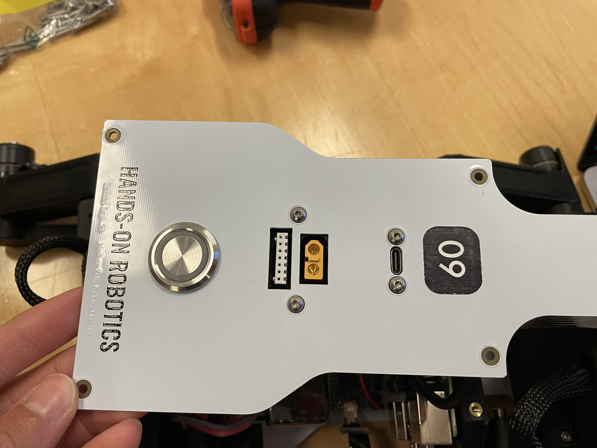
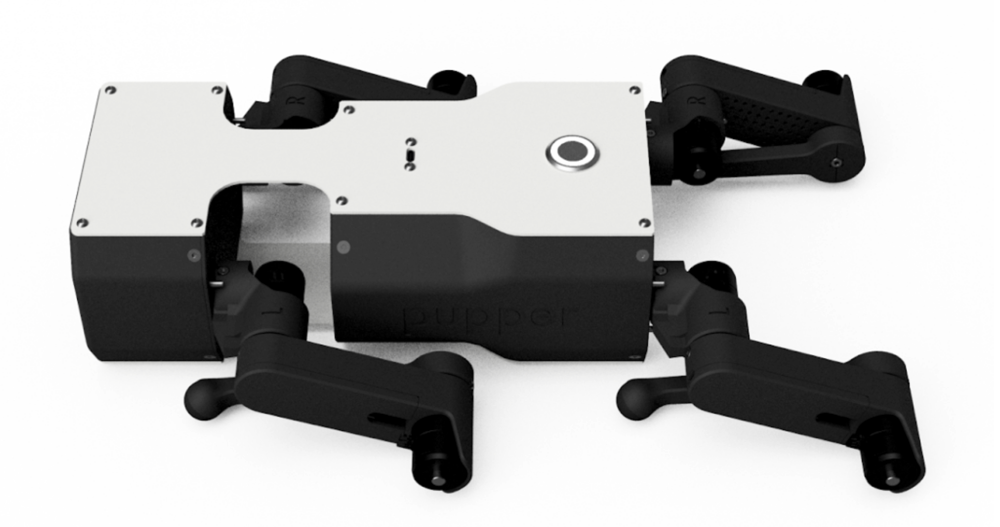
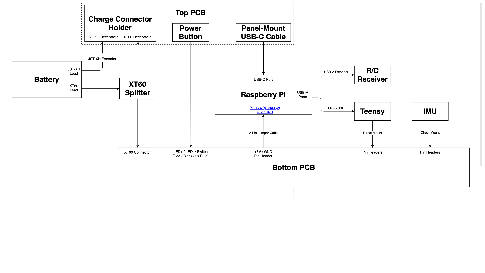

Lab 6 - Pupper Assembly
========================

.. contents:: :depth: 2

Lab instructions
-------------------

Step 1. Leg Assembly
^^^^^^^^^^^^^^^^^^^^^^^^^^^^^^^^^^^^^^^^
#. Assemble 2 left legs
#. Assemble 2 right legs

**TODO** add assembly videos

Step 2. Bulkhead assembly
^^^^^^^^^^^^^^^^^^^^^^^^^^^^^^^^^^^^^^^^
#. Insert end stop pins into motor bulkhead
#. Attach 2 motors, one into each side of motor bulkhead
#. Attach left and right legs to the shafts of the motors you just installed

**TODO** add assembly videos

Step 3. Electronic assembly
^^^^^^^^^^^^^^^^^^^^^^^^^^^^^
#. Connect motor controllers to motors
#. Calibrate motor controllers **TODO** Add video
#. Set IDs on motor controllers.   **TODO** Add video
#. Label the motor controllers and motor connector cables with the IDs in case you unplug them later.
#. Connect motor controller power cables and CAN connectors to bottom PCB
#. Insert motor controllers into slots
#. Put wire wrap around motor controller cables
#. Zip-tie wire wraps and cables to the motor bulkheads

    
    Motor controller ids.

Step 4. IMU prep
^^^^^^^^^^^^^^^^^^^^^^^^^^^^^^
#. Break off two 1x6 male header rows.
#. Place them on the *top* side of the IMU board (side with black connectors and the middle chip)
#. Insert the IMU with headers into a breadboard to help you solder the headers to the IMU
#. Solder the headers to the IMU

[insert picture here]

Step 5. Unmounted Raspberry Pi assembly
^^^^^^^^^^^^^^^^^^^^^^^^^^^^^^^^^^^^^^^^^^^^^^^^^^^^^^^^^^^^
#. Plug in IMU into bottom PCB with Sparkfun text facing towards the Teensy USB
#. Screw RPi into electronics bulkhead with M2.5x5 socket head screws such that the Pi is about centered on the electronics bulkhead
#. Connect USB C extension cable to Rpi
#. Connect RPi camera flex cable into RPi. There's a little grey flap that flips up on the connector that lets you slide the cable in. Flip the flap down to lock the cable in.

Step 6. Mounted Raspberry Pi assembly
^^^^^^^^^^^^^^^^^^^^^^^^^^^^^^^^^^^^^^^^^^^^^^^^^^^^^^^^^^^^
#. Mount electronics bulkhead into the bottom PCB with two M3x6 button head screws.
#. Connect RPi to power by using 2-pin cable. Connect one end into 5V, GND pins near the Teensy and other side into RPi. Quadruple-check that the 5V and GND pins are going the right places. See diagram below.
#. Mount RPi camera with 4x M2x3 screws to front cowling such that flex cable goes up. The screws thread into the plastic and may be tough to thread.
#. Connect RPi to Teensy using USB A to USB micro cable
#. Connect RC receiver to RPi with ribbon cable usb extension cable. The connectors have gray flaps that slide in/out to lock/unlock the cable.

Step 6.5. Bind RC receiver
^^^^^^^^^^^^^^^^^^^^^^^^^^^^^^^^^^^^^^^^^^^^^^^^^^^^^^^^^^^^
#. Bind the receiver [TODO: add instructions]

Step 7. Top panel assembly
^^^^^^^^^^^^^^^^^^^^^^^^^^^^^^^^^^^^^^^^^^^^^^^^^^^^^^^^^^^^
#. Screw the USB-C connector to the top PCB with M3x6 button head screws
#. Insert the XT60 female side (conductor is a circular slot) of XT60 splitter cable into 3D printed power hub. 
#. Connect other female XT60 into the bottom PCB
#. Insert JST-XH extender balance cable into 3D printed power hub.
#. Take the large nut off the power switch and then mount the power switch to the top PCB panel. Then secure the switch by threading on the nut from the bottom of the top panel.
#. Compare your build to the finished robot to see if you missed anything.
#. Verify your build so far with the class instructors and the photos below.

    
    RPi pinout. 

    
    Bulkhead wiring.

.. figure:: ../_static/djipupper_photos/IMG_0881.jpg
    :align: center
    
    Zip-tie close up.

    
    Leg assembly.

    
    Electronics assembly.

    
    Bottom view of top PCB.

    
    Top view of top PCB.

Step 8. Finish hardware assembly
^^^^^^^^^^^^^^^^^^^^^^^^^^^^^^^^^
#. Put velcro or dual-lock onto the bottom PCB where it says "battery". For now we'll use the power supply to run the robot so you don't have to install the actual battery.
#. Attach the top PCB panel with M3x6 button head screws. 
#. Check again with instructors.
#. Marvel at your work!

Step 9. Flash code onto the Teensy
^^^^^^^^^^^^^^^^^^^^^^^^^^^^^^^^^^^
#. ``git clone https://github.com/Nate711/DJIPupperTests.git``
#. Use VSCode PlatformIO to open the DJIPupperTests folder as a project and then upload the code to the Teensy. (Same thing as in labs 1-4).

Step 10. Flash software image onto Raspberry Pi
^^^^^^^^^^^^^^^^^^^^^^^^^^^^^^^^^^^^^^^^^^^^^^^^^^^^^^^^^^^^^^^^^^^^^^
#. Download our `image <https://drive.google.com/file/d/1LWupKrq-aiqHTXsXZ3rIQzXBHl4DCbSj/view?usp=sharing>`_
#. Install `Balena etcher <https://www.balena.io/etcher/>`_
#. Flash the image onto the micro SD card using Balena etcher. 
#. Insert the micro sd card into the Pi's micro sd card slot (on bottom side of board)

Step 11. Enable the heuristic controller
^^^^^^^^^^^^^^^^^^^^^^^^^^^^^^^^^^^^^^^^^^
#. Connect the robot to your computer via the top USB-C port on the robot.
#. SSH into the robot with ``ssh pi@raspberrypi.local``. The password is ``raspberry``. Ask for help if this doesn't work.
#. Run ``sudo systemctl enable --now robot`` to turn on the heuristic controller.
#. Run ``sudo systemctl status robot`` to check that the service is running ok (should be green).
#. Reboot with ``sudo reboot 0``

Step 12. Take your robot on a walk
^^^^^^^^^^^^^^^^^^^^^^^^^^^^^^^^^^^^
#. Unplug the Pi from USB C.
#. Place your robot on a flat, level surface. Position the legs as shown in the picture below.
#. Power on the robot by hooking up the power supply to the bottom PCB (like you've done in labs).
#. Connect the Pi with USB C to your computer.
#. Wait for the robot to complete the calibration sequence. **TODO** Add calibration video
#. Flip all switches on the back RC transmitter down so they're away from you.
#. Turn on the RC transmitter by pressing the middle power button and moving the left joystick up and down until the light turns blue.
#. Wait ~30s for the RPi to boot (the green light should stop blinking).
#. Flip the lower left switch on the controller up to enable the robot. It'll move!
#. Flip the lower right switch on the controller up to start the robot trotting.
#. Enjoy your hard work and play with Pupper! 

  * The top right switch flips between trotting and walking. 
  * Left/right on the left joystick controls turning. 
  * Up/down on the right joystick controls forward/back. 
  * Left/right on the right joystick controls strafing left/right.

    
    Startup position.

Resources
-----------

Wiring diagram
^^^^^^^^^^^^^^^^^^^^^^^^^^^^^^

    
    Wiring diagram.

Work in progress `manual <https://img1.wsimg.com/blobby/go/f1c92971-b8a4-41e7-ae17-e7be47117f4a/downloads/Pupper%202.1%20Manual.pdf?ver=1629132720898>`_.
^^^^^^^^^^^^^^^^^^^^^^^^^^^^^^^^^^^^^^^^^^^^^^^^^^^^^^^^^^^^^^^^^^^^^^^^^^^^^^^^^^^^^^^^^^^^^^^^^^^^^^^^^^^^^^^^^^^^^^^^^^^^^^^^^^^^^^^^^^^^^^^^^^^^^^^^^^^^^^^^^^^^^^^^^^^^^^^^^^^^^^^^^^^^^^^^^^^^^^^^^^^^^^^^^^
.. .. raw:: html

..     <iframe frameborder=“0” style=“width:100%;height:781px;” src=“https://viewer.diagrams.net/?tags=%7B%7D&highlight=0000ff&edit=_blank&layers=1&nav=1&title=Pupper%20Wiring%20Diagram.drawio#Uhttps%3A%2F%2Fdrive.google.com%2Fuc%3Fid%3D1yEQvr2gm86uTxlCF5FVwHrtBXnDOZnK8%26export%3Ddownload”></iframe>

