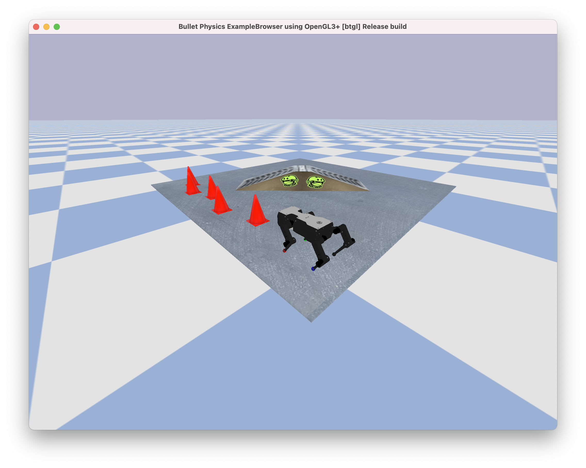
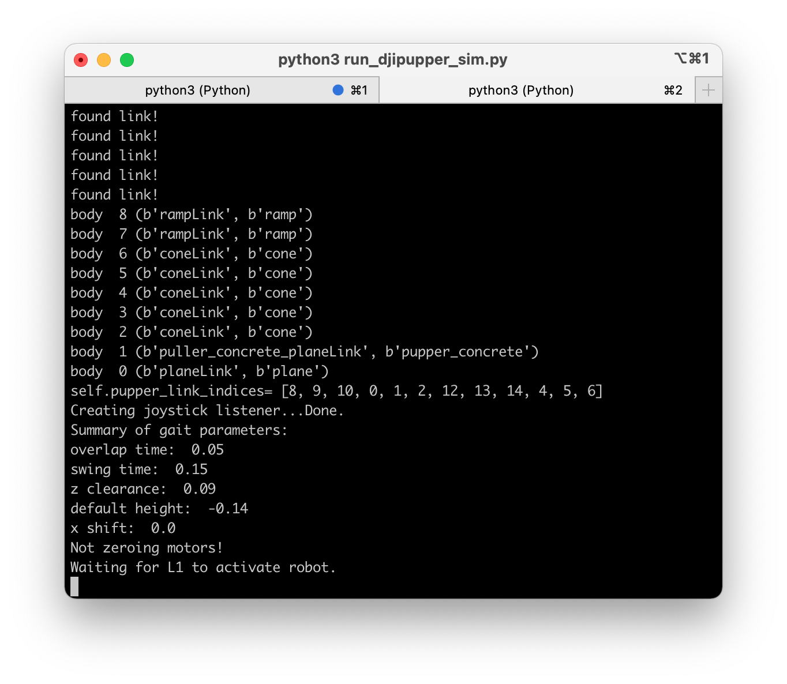

Lab 7 - Pupper Simulation 
=========================

.. contents:: :depth: 2

Mini-lecture - TBD
---------------------------------

* Video: Available soon

Lab instructions
-------------------

These instructions assume you are running mac or linux. If you have Windows 10 or lower, I recommend dual-booting linux. If you have Windows 11, try using the Windows Linux Subsystem

Step 1. Set up simulation environment
^^^^^^^^^^^^^^^^^^^^^^^^^^^^^^^^^^^^^^^^^^^^^^^^^^^^^^^^^^
#. ``git pull`` the latest ``puppersim`` repository, which is the same you used in Lab 5 ``https://github.com/jietan/puppersim/``.
#. Install additional dependencies ``pip3 install numpy transforms3d pyserial``. Use ``pip`` if ``pip3`` doesn't work.

Step 2. Try out the simulator
^^^^^^^^^^^^^^^^^^^^^^^^^^^^^^^^^^^^^^^^^^^^^^^^^^^^^^^^^^
#. Follow the instructions in the **Simulating the heuristic controller** section of the ``puppersim`` repository.
#. Check out these keyboard controls: 
    * wasd: --> moves robot forward/back left/right.
    * arrow keys: --> turns robot left/right
    * q: --> activates robot
    * e: --> starts trotting
    * ijkl: --> tilts robot
#. To activate the robot, press ``q``. To start trotting, press ``e``.
#. Enjoy the simulator!
#. To close the simulator, do not press use the usual close button in the top left of the simulator window. Instead do Ctrl-C in both terminal tabs/windows.

Expected result:

    
    Expected simulator window.
    

    
    Expected output from ``python3 run_djipupper_sim.py``.

Step 3. Experiment
^^^^^^^^^^^^^^^^^^^^^^^^^^^^^^^^^^^^^^^^^^^^^^^^^^^^^^^^^^
#. Try changing ``self.overlap_time`` (line 52) in ``StanfordQuadruped/djipupper/Config.py``. This controls the amount of time in which all four legs are on the ground for the trot.
#. Try changing ``self.swing_time`` (line 53) in ``StanfordQuadruped/djipupper/Config.py``. This controls the amount of time in which just two legs are on the ground for the trot.
#. Mess around with other things:

**Other available parameters**

Maximum commands:

* ``max_x_velocity``: Maximum forward velocity. Default: 0.6. Reasonable range: [0, 1.2]. Units: [meters/sec].
* ``max_y_velocity``: Maximum horizontal velocities. Default: 0.6. Reasonable range: [0, 1.2]. Units: [meters/sec].
* ``max_yaw_rate``: Maximum turning rate. Default: 2.5. Reasonable range: [0, 4]. Units: [rad/sec].

Foot placement parameters:

* ``delta_x``: When the robot is trotting in place, this is 1/2 the forward/back distance between the feet. Default: 0.1. Reasonable range: [0.05, 0.15]. Units: [meters].
* ``delta_y``: When the robot is trotting in place, this is 1/2 the left/right distance between the feet. Default: 0.1. Reasonable range: [0.05, 0.15]. Units: [meters].
* ``x_shift``: This is the amount that the robot walks in front of it's center of mass vs behind. Default: 0.005. Reasonable range: [-0.03, 0.03]. Units: [meters].
* ``default_z_ref``: Default amount that the feet are beneath the CoM of the robot. Default: -0.14. Reasonable range: [-0.05, -0.18]. Units: [meters].

Trotting parameters:

* ``overlap_time``: 1/2 the duration of time in each trot cycle when all four feet are on the ground. Default: 0.05. Reasonable range: [0, 0.25]. Units: [seconds].
* ``swing_time``: 1/2 the duration of time in each trot cycle when two feet are on the ground and two are in the air. Default: 0.15. Reasonable range: [0, 0.25]. Units: [seconds]. 
Note: The total period of the trot gait is ``2 * overlap_time + 2 * swing_time`` in seconds. So if you wanted a 1Hz gait, you could set ``overlap_time=0.25`` and ``swing_time=0.25``.