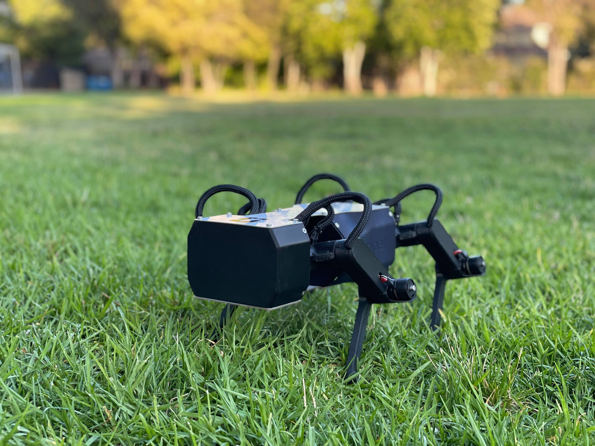

Stanford Robotics Independent Study
#######################################################

Course overview
****************

Students will build an agile four-legged robot and pursue an open-ended project based on the robot.

In the first half of the course, students will build and program a quadruped robot called Pupper. Pupper is an agile four-legged robot driven by twelve powerful BLDC actuators and controlled by an embedded microcontroller and Raspberry Pi. With one lab and one office hours-style work session each week, students will complete the robot while learning about mechatronic design and implementing robotics concepts in software. In the second half of the course, students will pursue an open-ended project such as teaching the robot to walk using reinforcement learning, building a vision system to allow the robot to play fetch, or redesigning the hardware to make the robot more agile. 

Researchers from Google Brain will give a guest lecture during the quarter on their work teaching robots using machine learning. 

Expected time commitment: 2 units, or about 6 hours per week. Students can sign up for up to 4 units if they want to spend more time on the project.

Estimated class size: 4 - 8 students

Prerequisites: CS106B or similar coding experience is recommended. Coding for the robot will be done in Python and C++. No robotics experience necessary.

Grading: Pass/Fail for 2 or more units. Grading based on participation.

Faculty sponsor: Mac Schwager

.. toctree::
    :maxdepth: 2
    :caption: Course material

    course-material/lab-1
    course-material/lab-2
    course-material/lab-3
    course-material/lab-4

.. toctree::
    :maxdepth: 1
    :caption: References

    reference/design
    reference/libraries

